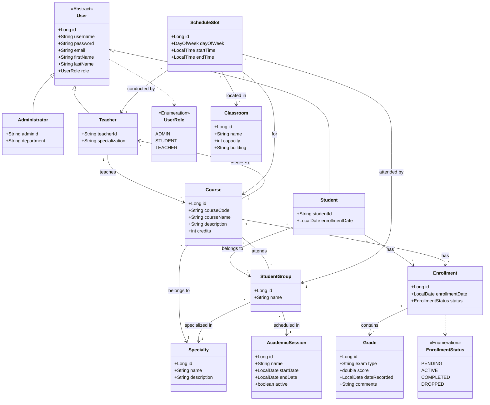

# Diagramme de Classe du Projet

```mermaid
classDiagram
    class User {
        <<Abstract>>
        +Long id
        +String username
        +String password
        +String email
        +String firstName
        +String lastName
        +UserRole role
    }

    class Administrator {
        +String adminId
        +String department
    }

    class Teacher {
        +String teacherId
        +String specialization
    }

    class Student {
        +String studentId
        +LocalDate enrollmentDate
    }

    class UserRole {
        <<Enumeration>>
        ADMIN
        STUDENT
        TEACHER
    }

    class Course {
        +Long id
        +String courseCode
        +String courseName
        +String description
        +int credits
    }

    class Specialty {
        +Long id
        +String name
        +String description
    }

    class StudentGroup {
        +Long id
        +String name
    }

    class AcademicSession {
        +Long id
        +String name
        +LocalDate startDate
        +LocalDate endDate
        +boolean active
    }

    class Classroom {
        +Long id
        +String name
        +int capacity
        +String building
    }

    class Enrollment {
        +Long id
        +LocalDate enrollmentDate
        +EnrollmentStatus status
    }

    class EnrollmentStatus {
        <<Enumeration>>
        PENDING
        ACTIVE
        COMPLETED
        DROPPED
    }

    class Grade {
        +Long id
        +String examType
        +double score
        +LocalDate dateRecorded
        +String comments
    }

    class ScheduleSlot {
        +Long id
        +DayOfWeek dayOfWeek
        +LocalTime startTime
        +LocalTime endTime
    }

    %% Relationships
    User <|-- Administrator
    User <|-- Teacher
    User <|-- Student
    User ..> UserRole

    Teacher "1" --> "*" Course : teaches
    Course "*" --> "1" Teacher : taught by

    Course "*" --> "1" Specialty : belongs to
    
    StudentGroup "*" --> "1" Specialty : specialized in
    StudentGroup "*" --> "1" AcademicSession : scheduled in

    Student "*" --> "1" StudentGroup : belongs to
    
    Course "*" -- "*" StudentGroup : attends
    
    Student "1" --> "*" Enrollment : has
    Course "1" --> "*" Enrollment : has
    
    Enrollment "1" --> "*" Grade : contains
    Enrollment ..> EnrollmentStatus

    ScheduleSlot "*" --> "1" Course : for
    ScheduleSlot "*" --> "1" Teacher : conducted by
    ScheduleSlot "*" --> "1" Classroom : located in
    ScheduleSlot "*" --> "1" StudentGroup : attended by
```
