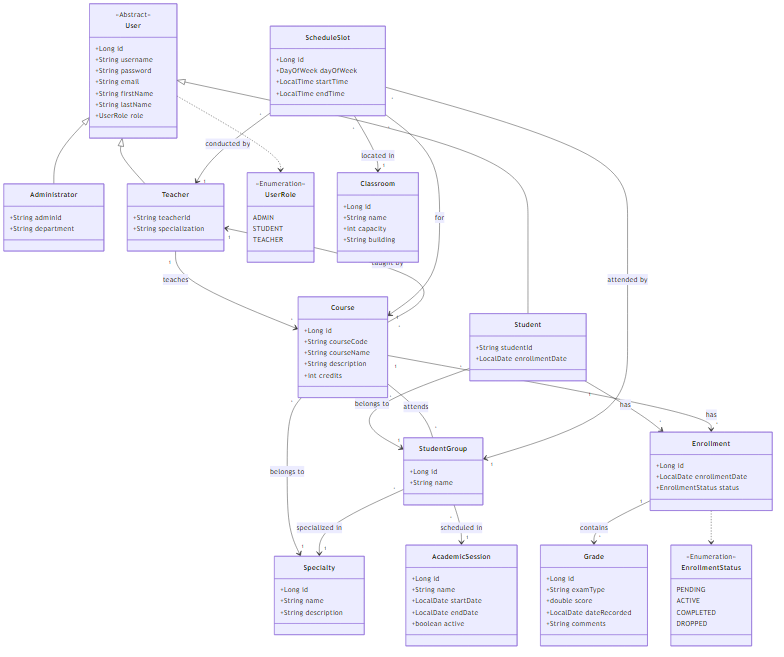

# Rapport de Projet: Système de Gestion Scolaire (School Management)

## 1. Spécifications du Projet

### 1.1 Contexte
Le projet consiste en une application web de gestion scolaire permettant l'administration des étudiants, des enseignants, des cours, et des résultats académiques. L'objectif est de digitaliser les processus administratifs et pédagogiques.

### 1.2 Besoins Fonctionnels
L'application gère trois acteurs principaux avec des fonctionnalités distinctes :

**1. Administrateurs :**
-   Gestion des utilisateurs (Création, Modification, Suppression des comptes).
-   Gestion des classes et des salles.
-   Planification des emplois du temps.
-   Gestion des cours et des matières.

**2. Enseignants :**
-   Consultation de leur emploi du temps.
-   Gestion des notes des étudiants.
-   Accès aux listes d'étudiants par cours.

**3. Étudiants :**
-   Consultation de l'emploi du temps personnel.
-   Consultation des notes et bulletins.
-   Inscription aux cours (si applicable).

### 1.3 Besoins Non-Fonctionnels
-   **Sécurité** : Authentification et autorisation basées sur les rôles (RBAC) via Spring Security. Protection des mots de passe avec BCrypt.
-   **Fiabilité** : Intégrité des données assurée par les transactions SGBD (MySQL).
-   **Maintenabilité** : Architecture modulaire respectant les standards Spring Boot.

## 2. Architecture Logicielle

### 2.1 Stack Technique
-   **Langage** : Java 21
-   **Framework Backend** : Spring Boot 3.2.1
-   **Sécurité** : Spring Security 6 + JWT (pour API) + Form Login (pour Web)
-   **Accès aux Données** : Spring Data JPA / Hibernate
-   **Base de Données** : MySQL 8
-   **Moteur de Template** : Thymeleaf
-   **Outils** : Maven, Lombok, iText (PDF)

### 2.2 Architecture en Couches
Le projet suit une architecture classique N-Tiers :
1.  **Presentation Layer (`controller`)** : Gère les requêtes HTTP (Web et API).
2.  **Service Layer (`service`)** : Contient la logique métier.
3.  **Data Access Layer (`repository`)** : Interfaces communiquant avec la base de données.
4.  **Persistance Layer (`entity`)** : Représente le modèle de données objet-relationnel.

## 3. Conception Détaillée

### 3.1 Diagramme de Classe
Le diagramme suivant illustre les relations entre les différentes entités du système (Utilisateurs, Cours, Notes, etc.).



### 3.2 Description des Entités Principales
-   **User (Abstrait)** : Classe parente pour tous les acteurs (Admin, Student, Teacher). Contient les informations de connexion.
-   **AcademicSession** : Définit les périodes scolaires (ex: Semestre 1).
-   **Course** : Représente une matière enseignée, liée à un enseignant et une spécialité.
-   **StudentGroup** : Groupe d'étudiants (ex: TD1, TP2).
-   **Enrollment** : Table de liaison gérant l'inscription d'un étudiant à un cours.
-   **Grade** : Note obtenue par un étudiant dans le cadre d'une inscription.
-   **ScheduleSlot** : Créneau horaire d'un cours (Jour, Heure, Salle).

## 4. Réalisation et Implémentation

### 4.1 Structure du Projet
L'arborescence du code source est organisée par fonctionnalité technique :
```
src/main/java/com/example/SpringProject
├── config/          # Configurations (Sécurité, Data init)
├── controller/      # Contrôleurs Web et API
├── dto/             # Data Transfer Objects
├── entity/          # Entités JPA
├── repository/      # Interfaces Spring Data
├── security/        # Filtres JWT et gestionnaires d'auth
└── service/         # Services métier
```

### 4.2 Interfaces Utilisateur
L'application dispose d'une interface web rendue côté serveur avec Thymeleaf :
-   **Page de Connexion** : Point d'entrée sécurisé.
-   **Tableaux de Bord** : Vues spécifiques pour Admin, Professeur, et Étudiant.
-   **Formulaires** : Création/Edition de ressources (Cours, Étudiants).
-   **Listes** : Affichage tabulaire des données avec actions contextuelles.

### 4.3 Sécurité
La sécurité est implémentée à deux niveaux :
1.  **Session Web** : Pour l'interface utilisateur standard.
2.  **JWT (JSON Web Token)** : Pour les futurs clients mobiles ou SPA comsommant l'API REST.

---
*Ce rapport a été généré automatiquement à partir de l'analyse du code source et des artefacts du projet.*
